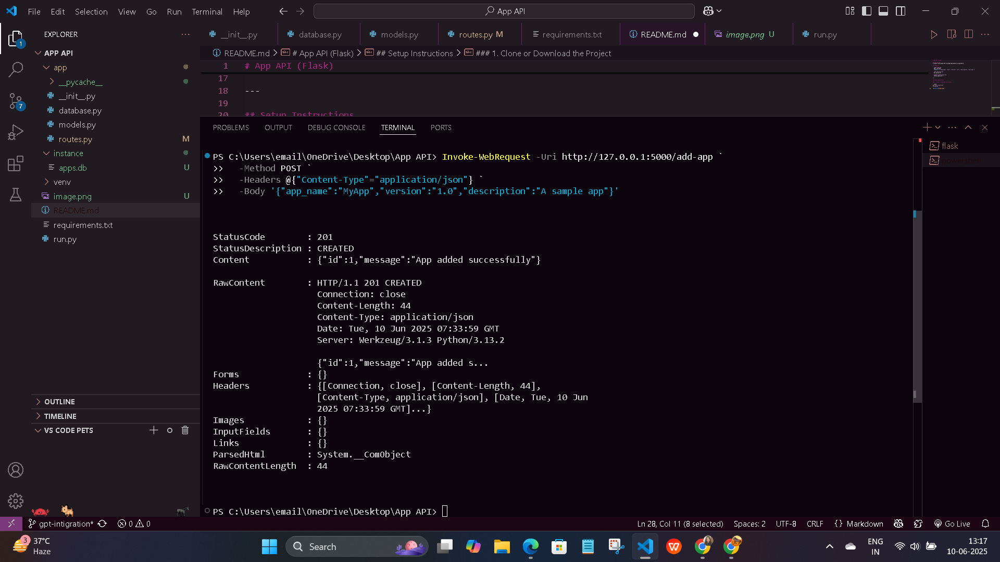
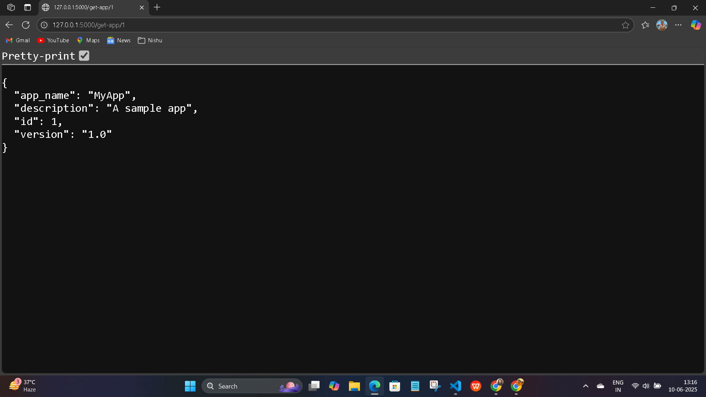
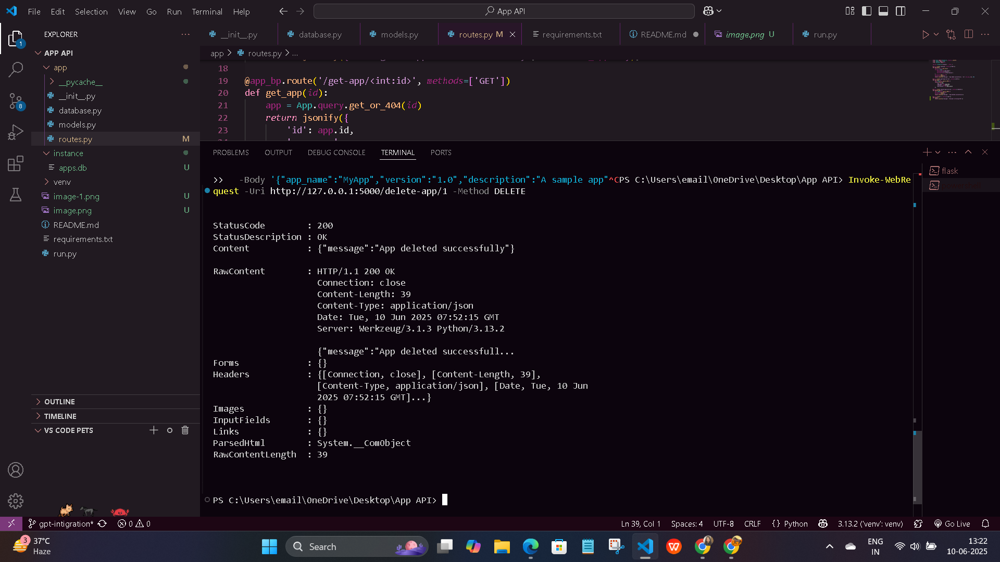
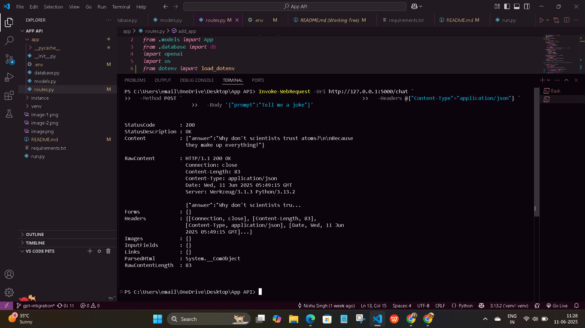

# App API (Flask)

## Description
A simple Flask-based API to manage app details using SQLite and interact with OpenAI's GPT models.

## Endpoints

- `POST /add-app`  
  Add a new app.  
  **Body:** `{ "app_name": "Test", "version": "1.0", "description": "Test app" }`

- `GET /get-app/<id>`  
  Get app by ID.

- `DELETE /delete-app/<id>`  
  Delete app by ID.

- `POST /chat`  
  Get a GPT-powered response to a prompt.  
  **Body:**  
  ```json
  { "prompt": "Tell me a joke." }
  ```

---

## Setup Instructions

### 1. Clone or Download the Project

```bash
git clone <git@github.com:nishusingh02/rest-api.git>
cd "rest-api"
```

### 2. Install Dependencies

```bash
pip install -r requirements.txt
```

### 3. Set the OpenAI API Key

Create a `.env` file in the `app` directory with your OpenAI API key:

```
OPENAI_API_KEY=your_openai_api_key_here
```
### 4. Run the Flask App

On Windows (PowerShell):

```powershell
$env:FLASK_APP=app
$env:FLASK_ENV=development
flask run
```

## Example: Test the `/chat` Endpoint

**PowerShell:**
```powershell
Invoke-WebRequest -Uri http://127.0.0.1:5000/chat `
  -Method POST `
  -Headers @{"Content-Type"="application/json"} `
  -Body '{"prompt":"Tell me a joke."}'
```
**curl (Git Bash/WSL):**
```bash
curl -X POST http://127.0.0.1:5000/chat -H "Content-Type: application/json" -d "{\"prompt\":\"Tell me a joke.\"}"
```

You will receive a JSON response with the AI's answer.

## Example Outputs

### Add App


### Get App


### Delete App


### Chat Endpoint

